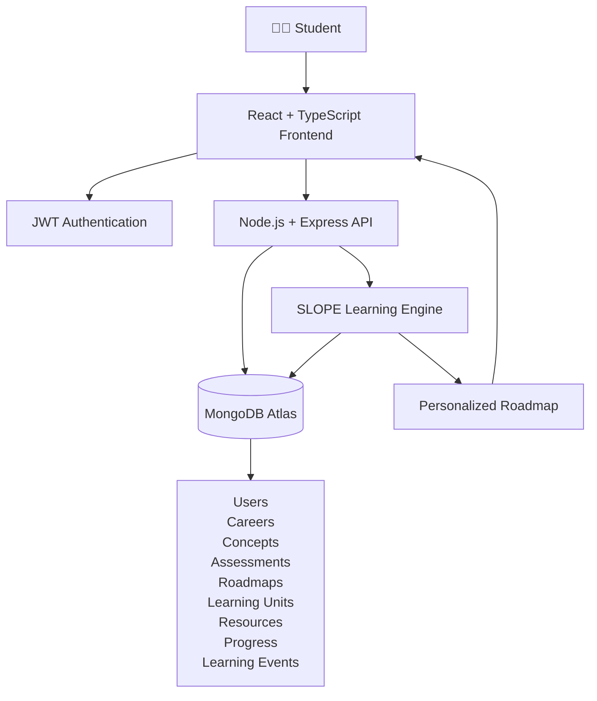
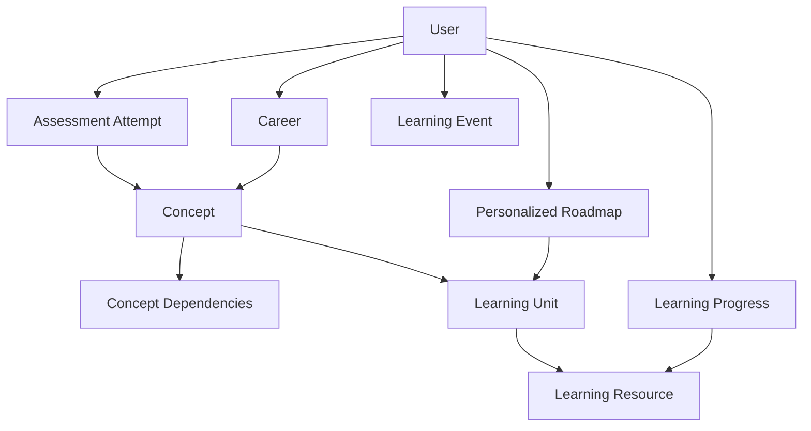
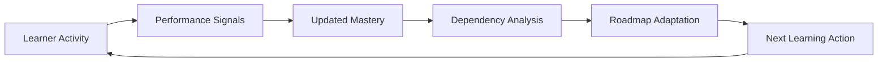
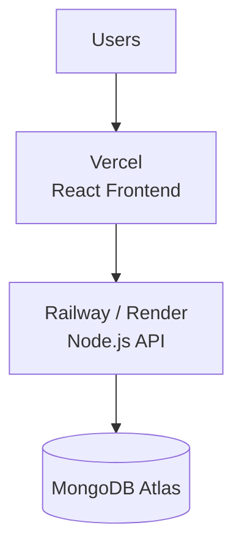

# SLOPE 2.0 🚀

### An adaptive learning platform for CSE students — built around the learner, not a generic course dashboard.

SLOPE is a full-stack personalized learning platform designed to turn a student's current knowledge into a **personalized, dependency-aware learning roadmap**.

Instead of giving every learner the same sequence of topics, SLOPE starts with a baseline assessment, measures concept-level mastery, and uses that information to determine what the learner should learn next.

> **Choose a path → assess your knowledge → get your roadmap → learn → track progress.**

---

## ✨ Why SLOPE?

Most learning platforms are optimized around **courses and content**.

SLOPE is being designed around the **learner's state**.

A student may already understand HTML and CSS but struggle with JavaScript fundamentals. Another student may know JavaScript well but have gaps in APIs, databases, or authentication.

SLOPE's goal is to make the learning path reflect those differences.

### Traditional Learning Platform

```text
Student
   ↓
Course
   ↓
Lesson
   ↓
Lesson
   ↓
Lesson
```

Everyone generally follows the same predefined sequence.

### SLOPE

```text
Student
   ↓
Baseline Assessment
   ↓
Concept-Level Mastery
   ↓
Dependency Analysis
   ↓
Personalized Roadmap
   ↓
Learning Units
   ↓
Resources
   ↓
Progress
   ↓
Updated Learner State
   ↓
Next Learning Step
```

---

# 🎯 Project Vision

SLOPE is being built as a platform where a CSE learner can:

- Choose a career path
- Assess their current knowledge
- Receive an individualized roadmap
- Learn concepts in dependency-aware order
- Complete learning resources
- Track their progress
- Build practical skills
- Eventually receive AI-powered tutoring
- Eventually prepare for projects, interviews, and placements

The architecture is intentionally designed so additional career paths can be added later without rewriting the core roadmap engine.

---

# 🧭 Current Product Direction

The first deeply implemented career path is:

> ## Full Stack Developer

The product architecture is designed to support additional career paths later:

1. Frontend Developer
2. Backend Developer
3. AI/ML Engineer
4. Data Scientist
5. Data Analyst
6. Software Engineer
7. DevOps Engineer
8. Cybersecurity
9. Competitive Programmer
10. Other

### Important Product Rule

A learner can have multiple long-term career goals, but:

> **One active learning path at a time.**

This allows SLOPE to focus its personalization engine on the learner's current objective.

---

# 🏗️ System Architecture



---

# 🔄 Core SLOPE Learning Loop

The central idea behind SLOPE is the continuous learner-state loop.

```mermaid
flowchart LR

    A[Choose Career Path]
    B[Baseline Assessment]
    C[Measure Concept Mastery]
    D[Analyze Dependencies]
    E[Generate Personalized Roadmap]
    F[Open Learning Unit]
    G[Study Resources]
    H[Complete Resources]
    I[Persist Progress]
    J[Complete Unit]
    K[Update Learner State]

    A --> B
    B --> C
    C --> D
    D --> E
    E --> F
    F --> G
    G --> H
    H --> I
    I --> J
    J --> K
    K --> E
```



The important part is that the learner's state is not static.

As the learner studies and completes concepts, SLOPE can eventually use the new information to determine what should happen next.

---

# 🧠 How SLOPE Personalization Works

The personalization engine is based on the relationship between:

```text
Learner
   ↓
Assessment
   ↓
Concept Mastery
   ↓
Concept Dependencies
   ↓
Learning Units
   ↓
Resources
   ↓
Progress
```

### Example

Imagine a learner chooses:

```text
Full Stack Developer
```

Their assessment might indicate:

```text
HTML              → Strong
CSS               → Strong
JavaScript        → Weak
React             → Unknown
Node.js           → Unknown
REST APIs         → Unknown
MongoDB           → Unknown
Authentication    → Unknown
```

SLOPE should not immediately throw the learner into advanced React or backend topics.

Instead, the roadmap can recognize that:

```text
JavaScript
   ↓
React
   ↓
Node.js
   ↓
REST APIs
   ↓
Authentication
```

and prioritize the missing prerequisite knowledge.

---

# 🧩 Dependency-Aware Learning

Learning concepts are not independent.

For example:

```text
JavaScript Fundamentals
          ↓
ES6+
          ↓
Async JavaScript
          ↓
API Consumption
          ↓
React
          ↓
Node.js
          ↓
REST APIs
          ↓
Authentication
          ↓
Full Stack Projects
```

SLOPE uses this dependency structure as part of roadmap generation.

The goal is to prevent learners from being pushed into concepts before they have the required foundation.

---

# 📦 Phase 5 — Implemented Features

The current implementation reaches:

> ## Phase 5 — Learning & Progress

### Foundation

- React + TypeScript frontend
- Vite development environment
- Node.js backend
- Express API
- TypeScript backend
- MongoDB
- Mongoose
- Environment configuration

---

## 🔐 Authentication

Implemented:

- User registration
- User login
- JWT authentication
- Protected API routes
- Authenticated frontend state
- Password-based authentication flow

---

## 🎯 Career System

Implemented:

- Career path selection
- Full Stack Developer curriculum
- Career/concept relationships
- Curriculum seed data

The architecture is designed so additional career paths can be added without rebuilding the entire system.

---

# 📝 Baseline Assessment

SLOPE uses an assessment as the starting point for personalization.

Implemented:

- Baseline assessment
- MCQ-style questions
- Concept-linked questions
- Answer submission
- Assessment attempt persistence
- Concept-level mastery calculation

Instead of only producing:

```text
Your score: 72%
```

SLOPE stores information about individual concepts.

Example:

```text
JavaScript → 40%
React      → 20%
HTML       → 90%
CSS        → 85%
```

This gives the roadmap engine more useful information.

---

# 🧠 Concept Mastery

Concept mastery is one of the foundations of SLOPE.

The system can represent learning state at the concept level.

```text
Career
   ↓
Concept
   ↓
Mastery
   ↓
Dependency
   ↓
Learning Unit
```

This allows future versions to become increasingly adaptive.

---

# 🗺️ Personalized Roadmap

The roadmap engine uses:

- Learner state
- Concept mastery
- Concept dependencies
- Curriculum structure
- Learning units

to generate a learner-specific roadmap.

### Example

Student A:

```text
HTML ✓
CSS ✓
JavaScript ✗
```

might receive:

```text
1. JavaScript Fundamentals
2. ES6+
3. Async JavaScript
4. DOM & Browser APIs
5. React Fundamentals
```

Another learner who already knows JavaScript could receive:

```text
1. React Fundamentals
2. State Management
3. API Integration
4. Node.js
5. REST APIs
```

The roadmap is therefore intended to be **learner-specific rather than globally fixed**.

---

# 📚 Learning System

Phase 5 introduces the actual learning experience.

Implemented:

- Learning units
- Learning objectives
- Learning sections
- Learning resources
- Resource tracking
- Resource completion
- Learning-unit completion

The learner can move from:

```text
Roadmap
   ↓
Learning Unit
   ↓
Resource
   ↓
Complete
   ↓
Next Resource
```

---

# 📊 Progress Tracking

SLOPE persists learner progress in MongoDB.

Tracked information includes:

- Resource completion
- Learning-unit completion
- Learning activity
- Learning events

This provides the foundation required for future adaptive learning.

---

# 📈 Learning Events

SLOPE also records learning events.

Conceptually:

```text
Student
   ↓
Opens Resource
   ↓
Studies Resource
   ↓
Completes Resource
   ↓
Completes Learning Unit
   ↓
Learning Event
   ↓
Learner State
```

Future versions can use these events as signals for adaptation.

---

# 🎨 Product Experience

SLOPE is intentionally moving away from a traditional admin-style dashboard.

The target product experience is inspired by modern learning/productivity interfaces such as the visual simplicity and focused experience of Paradigm.

However, SLOPE is not intended to simply copy another platform.

The goal is to build a unique:

> **Roadmap-first learning experience**

where the roadmap is the learner's primary navigation model.

---

# 🎨 UI Design Principles

The interface should prioritize:

- Minimal cognitive overload
- Clear next action
- Strong visual hierarchy
- Roadmap-first navigation
- Focused learning sessions
- Concept-oriented learning
- Meaningful progress
- Learner-specific content
- Clean typography
- Modern visual hierarchy
- Responsive design

Instead of showing users dozens of unrelated cards, SLOPE should continuously answer:

> **What should I learn next?**

---

# 🆚 SLOPE vs Traditional Learning Platforms

### Traditional

```text
                    Course Catalog
                         ↓
                 Select a Course
                         ↓
                   Fixed Curriculum
                         ↓
                    Watch Content
                         ↓
                    Finish Course
```

### SLOPE

```text
                    Student
                       ↓
                   Assessment
                       ↓
                Concept Mastery
                       ↓
              Dependency Analysis
                       ↓
             Personalized Roadmap
                       ↓
                 Learning Unit
                       ↓
                   Resources
                       ↓
                  Progress
                       ↓
             Updated Learner State
                       ↓
             Next Best Learning Step
```

---

# 💡 Product Differentiation

SLOPE is not trying to differentiate simply by having:

- More videos
- More courses
- More quizzes
- More content

The main differentiation is:

> **Personalization around the learner's actual skill state.**

The long-term goal is to make SLOPE capable of understanding:

```text
What the learner knows
        +
What the learner doesn't know
        +
What they need to know next
        +
What prerequisites are missing
        +
What they have already completed
        ↓
What should they learn next?
```

---

# 🛠️ Tech Stack

## Frontend

- React
- TypeScript
- Vite
- Tailwind CSS

## Backend

- Node.js
- Express
- TypeScript

## Database

- MongoDB
- MongoDB Atlas
- Mongoose

## Authentication

- JWT

## Development

- npm
- tsx
- Vite
- REST APIs

---

# 📁 Project Structure

```text
SLOPE-2.0-phase5/
│
├── backend/
│   │
│   ├── src/
│   │   ├── db/
│   │   │   └── mongoose.ts
│   │   │
│   │   ├── middleware/
│   │   │   ├── auth.ts
│   │   │   └── error.ts
│   │   │
│   │   ├── models/
│   │   │   └── models.ts
│   │   │
│   │   ├── routes/
│   │   │   ├── auth.ts
│   │   │   ├── assessments.ts
│   │   │   ├── careers.ts
│   │   │   ├── learning.ts
│   │   │   └── roadmaps.ts
│   │   │
│   │   ├── seed/
│   │   │   └── seed.ts
│   │   │
│   │   ├── services/
│   │   │   └── engines.ts
│   │   │
│   │   └── server.ts
│   │
│   ├── .env.example
│   ├── package.json
│   └── tsconfig.json
│
├── frontend/
│   │
│   ├── src/
│   │   ├── components/
│   │   │   └── Layout.tsx
│   │   │
│   │   ├── pages/
│   │   │   ├── Assessment.tsx
│   │   │   ├── Auth.tsx
│   │   │   ├── Careers.tsx
│   │   │   ├── Landing.tsx
│   │   │   ├── Learning.tsx
│   │   │   └── Roadmap.tsx
│   │   │
│   │   ├── api.ts
│   │   ├── auth.tsx
│   │   ├── App.tsx
│   │   ├── index.css
│   │   └── main.tsx
│   │
│   ├── .env.example
│   ├── package.json
│   └── vite.config.ts
│
├── docs/
│   ├── PHASE-5.md
│   └── ARCHITECTURE.md
│
├── .gitignore
└── README.md
```

---

# 🗃️ Data Model

The core data relationships can be represented as:



---

# 🔐 Environment Variables

## Backend

Create:

```text
backend/.env
```

Example:

```env
MONGODB_URI=your_mongodb_connection_string
JWT_SECRET=your_long_random_secret
PORT=8000
```

## Frontend

Create:

```text
frontend/.env
```

Example:

```env
VITE_API_URL=http://localhost:8000
```

> ⚠️ Never commit your `.env` file or MongoDB credentials to GitHub.

---

# 🚀 Local Development

## Prerequisites

Make sure you have:

- Node.js
- npm
- MongoDB Atlas account
- Git

---

## 1. Clone the Repository

```bash
git clone YOUR_REPOSITORY_URL
cd SLOPE-2.0-phase5
```

---

# 2. Install Backend Dependencies

```bash
cd backend
npm install
```

---

# 3. Configure Backend Environment

```bash
cp .env.example .env
```

Add your MongoDB Atlas connection string:

```env
MONGODB_URI=your_connection_string
```

Generate a strong JWT secret:

```env
JWT_SECRET=your_secret
```

---

# 4. Seed the Database

```bash
npm run seed
```

---

# 5. Start Backend

```bash
npm run dev
```

Backend should run on:

```text
http://localhost:8000
```

---

# 6. Install Frontend Dependencies

Open another terminal:

```bash
cd frontend
npm install
```

---

# 7. Configure Frontend

```bash
cp .env.example .env
```

Set:

```env
VITE_API_URL=http://localhost:8000
```

---

# 8. Start Frontend

```bash
npm run dev
```

Frontend should run on:

```text
http://localhost:5173
```

---

# 🔄 Complete User Flow

The current MVP is designed around this flow:

```text
┌─────────────────────┐
│     Landing Page    │
└──────────┬──────────┘
           ↓
┌─────────────────────┐
│ Register / Login    │
└──────────┬──────────┘
           ↓
┌─────────────────────┐
│ Choose Career Path  │
└──────────┬──────────┘
           ↓
┌─────────────────────┐
│ Baseline Assessment │
└──────────┬──────────┘
           ↓
┌─────────────────────┐
│ Concept Mastery     │
└──────────┬──────────┘
           ↓
┌─────────────────────┐
│ Personalized        │
│ Roadmap             │
└──────────┬──────────┘
           ↓
┌─────────────────────┐
│ Learning Unit       │
└──────────┬──────────┘
           ↓
┌─────────────────────┐
│ Learning Resources  │
└──────────┬──────────┘
           ↓
┌─────────────────────┐
│ Complete Resources  │
└──────────┬──────────┘
           ↓
┌─────────────────────┐
│ Progress Saved      │
└──────────┬──────────┘
           ↓
┌─────────────────────┐
│ Learning Events     │
└──────────┬──────────┘
           ↓
      Future Adaptive
          Engine
```

---

# 🧪 Phase 5 Scope

The purpose of Phase 5 is to prove that the core learning loop works.

### Included

```text
Authentication
      ↓
Career Selection
      ↓
Assessment
      ↓
Mastery
      ↓
Roadmap
      ↓
Learning
      ↓
Progress
      ↓
Events
```

### Not Included Yet

The following are intentionally planned for later phases:

- AI Tutor
- Advanced adaptive learning
- Study Planner
- Placement preparation
- Admin system
- Advanced analytics
- Multiple deep career paths
- AI-powered roadmap generation

This separation is intentional.

The deterministic learning foundation should work before AI is introduced.

---

# 🗺️ Product Roadmap

## Phase 1 — Foundation

```text
Project Architecture
        ↓
Database
        ↓
Backend API
        ↓
Frontend
        ↓
Core Data Models
```

---

## Phase 2 — Authentication & Career

```text
JWT Authentication
        ↓
Users
        ↓
Career Selection
        ↓
Curriculum
```

---

## Phase 3 — Assessment

```text
Question Bank
        ↓
Baseline Assessment
        ↓
Concept Mapping
        ↓
Mastery Calculation
```

---

## Phase 4 — Personalized Roadmap

```text
Concept Dependencies
        ↓
Dependency Analysis
        ↓
Roadmap Generation
        ↓
Learner-Specific Roadmap
```

---

## Phase 5 — Learning & Progress ✅

```text
Learning Units
        ↓
Resources
        ↓
Resource Completion
        ↓
Unit Completion
        ↓
Progress Persistence
        ↓
Learning Events
```

---

# 🚀 Phase 6 — Adaptive Learning

The next major engineering milestone is to make SLOPE genuinely adaptive.

The intended architecture:



Instead of generating a roadmap only once:

```text
Assessment
    ↓
Roadmap
```

the future system should continuously adapt:

```text
Learning
   ↓
Performance
   ↓
Mastery Update
   ↓
Roadmap Update
   ↓
Next Best Action
```

---

# 🤖 Future AI Tutor

AI is planned as an enhancement layer rather than the foundation of the platform.

Potential AI Tutor capabilities:

### Concept Explanation

```text
"Explain closures in JavaScript."
```

The tutor can provide a learner-appropriate explanation.

### Socratic Learning

Instead of immediately giving the answer:

```text
Question
   ↓
Hint
   ↓
Guiding Question
   ↓
Learner Attempts
   ↓
Feedback
```

### Code Debugging

The tutor could eventually help identify:

- syntax issues
- logical mistakes
- incorrect assumptions
- edge cases
- architecture problems

### Context-Aware Tutoring

Future versions can provide the AI with:

```text
Current Career Path
+
Current Concept
+
Mastery Level
+
Current Learning Unit
+
Current Resource
```

This allows the AI Tutor to become more relevant to the learner's actual position in the roadmap.

---

# 📅 Future Study Planner

A future Study Planner can convert the roadmap into an actionable schedule.

Example:

```text
Goal:
Become Full Stack Developer

Available:
2 hours/day

Target:
12 weeks
```

The planner could produce:

```text
Monday
JavaScript Fundamentals

Tuesday
JavaScript Functions

Wednesday
Async JavaScript

Thursday
API Consumption

Friday
Practice

Saturday
Mini Project

Sunday
Revision
```

This feature is planned for a later phase.

---

# 💼 Future Placement Module

The long-term placement layer can include:

- MCQs
- Coding problems
- Project tasks
- Technical interviews
- Behavioral interviews
- Resume-oriented projects
- Skill-gap analysis
- Placement readiness

The system could eventually connect placement performance back to the learner's roadmap.

Example:

```text
Coding Assessment
       ↓
Weak DSA
       ↓
Skill Gap
       ↓
Personalized Practice
       ↓
Improved Mastery
```

---

# 🌎 Multi-Career Expansion

After the Full Stack Developer path is stable, the curriculum model can expand.

Potential paths:

```text
Frontend
Backend
Full Stack
AI/ML
Data Science
Data Analytics
Software Engineering
DevOps
Cybersecurity
Competitive Programming
```

The key architectural requirement is:

> Career paths should be data-driven rather than hardcoded into the application.

---

# 📈 Scalability Architecture

The initial deployment direction is:



As SLOPE grows, additional infrastructure can be introduced.

Potential future components:

```text
CDN
 ↓
Frontend
 ↓
API Gateway
 ↓
Application Servers
 ↓
Caching
 ↓
Database
 ↓
Background Jobs
 ↓
AI Services
 ↓
Analytics
```

---

# 📊 Future Scalability Improvements

Potential improvements include:

- Database indexing
- API rate limiting
- Redis caching
- Background job processing
- Queue-based event processing
- Observability
- Structured logging
- Error tracking
- Database optimization
- Horizontal API scaling
- AI service separation
- Content management system
- Analytics pipeline

---

# 🧩 Engineering Principles

## 1. Deterministic Foundation First

AI should not hide weak application architecture.

The basic system must work without AI.

```text
Assessment
   ↓
Mastery
   ↓
Roadmap
   ↓
Learning
   ↓
Progress
```

must work deterministically.

---

## 2. Learner State Is First-Class Data

The platform should not only know:

> What courses exist?

It should know:

> What does this learner know?

and eventually:

> What should this learner learn next?

---

## 3. Career Paths Should Be Configurable

Instead of writing separate roadmap logic for every career:

```text
if career == frontend
...
if career == backend
...
if career == AI
...
```

the system should eventually use structured curriculum data.

---

## 4. Dependencies Matter

A learner shouldn't be forced to learn concepts in an arbitrary order.

Concept relationships should influence the roadmap.

---

## 5. Progress Should Be Persistent

The learner's progress should survive:

- logout
- login
- browser refresh
- device changes

because learning state belongs to the learner, not the browser.

---

# 🔒 Security Considerations

Production deployment should include:

- HTTPS
- Secure JWT handling
- Password hashing
- Environment variables
- CORS configuration
- API validation
- Rate limiting
- Input sanitization
- Secure database credentials
- Error handling without leaking secrets
- Proper authorization checks

---

# 🧪 Testing Strategy

As SLOPE grows, testing should cover:

### Backend

- Authentication
- API routes
- Database models
- Assessment scoring
- Mastery calculation
- Roadmap generation
- Progress persistence

### Frontend

- Authentication flow
- Career selection
- Assessment flow
- Roadmap rendering
- Learning resource flow
- Progress UI

### Engine

The most important tests should validate:

```text
Given learner state X
+
Curriculum Y
+
Dependencies Z

Expected roadmap = R
```

This makes personalization logic explainable and testable.

---

# 📌 Important Product Philosophy

SLOPE should not become:

> "ChatGPT wrapped inside a course website."

The core value should remain:

```text
Learner Model
      +
Curriculum Graph
      +
Assessment
      +
Mastery
      +
Dependencies
      +
Progress
      =
Personalized Learning System
```

AI can then be added on top of this foundation.

---

# 💼 Resume Positioning

### Resume Project Title

**SLOPE — Adaptive Learning Platform for CSE Students**

### Resume Description

> Built a full-stack personalized learning platform using React, TypeScript, Node.js, Express, MongoDB and JWT authentication. Implemented concept-level assessment, deterministic mastery calculation, dependency-aware personalized roadmaps, learning resources and persistent progress tracking.

### Stronger Engineering Version

> Designed and implemented a learner-centric roadmap engine that converts assessment results into concept-level mastery and personalized learning sequences, with MongoDB-backed progress and learning-event persistence.

### Technologies

```text
React
TypeScript
Vite
Node.js
Express
MongoDB
Mongoose
JWT
Tailwind CSS
REST APIs
```

---

# 🏆 What SLOPE Demonstrates

SLOPE is designed to demonstrate more than basic CRUD development.

It combines:

- Frontend architecture
- Backend architecture
- REST API design
- Authentication
- Database modeling
- Assessment systems
- Recommendation logic
- Dependency graphs
- Personalization
- Progress persistence
- Learning analytics foundations
- Scalable system design
- AI-ready architecture

---

# 📚 Core Technical Concepts Demonstrated

```text
React
│
├── Component Architecture
├── Routing
├── State Management
└── API Integration

Node.js / Express
│
├── REST APIs
├── Middleware
├── Authentication
└── Business Logic

MongoDB
│
├── Data Modeling
├── Relationships
├── Persistence
└── Learner State

Learning Engine
│
├── Mastery
├── Dependencies
├── Roadmap Generation
└── Personalization
```

---

# 🧠 Long-Term Vision

The long-term vision of SLOPE is to become a:

> ## Personal Learning Operating System for CSE Students

Instead of asking:

> "Which course should I watch?"

the learner should eventually be able to ask:

> **"Given what I know, what should I learn next, why should I learn it, and how can I prove that I learned it?"**

SLOPE is being built to answer that question.

---

# 📍 Current Status

```text
Phase 1   Foundation                    ✅
Phase 2   Authentication + Career       ✅
Phase 3   Assessment                    ✅
Phase 4   Personalized Roadmap          ✅
Phase 5   Learning + Progress           ✅
Phase 6   Adaptive Learning             🚧
AI Tutor                                  🔮
Study Planner                             🔮
Placement Module                          🔮
Multi-Career Expansion                    🔮
```

---

# 🛣️ Development Philosophy

SLOPE will be developed incrementally.

The priority is:

```text
Working MVP
     ↓
Reliable Learning Loop
     ↓
Adaptive Learning
     ↓
AI Assistance
     ↓
Placement Intelligence
     ↓
Multi-Career Platform
     ↓
Production Scale
```

The goal is not to build hundreds of features quickly.

The goal is to make the **core learning experience genuinely useful**.

---

# 🤝 Contributing

SLOPE is currently being developed as an individual project.

Future contribution guidelines may be added as the project evolves.

---

# 📄 License

Add the appropriate license for your repository here.

For example:

```text
MIT License
```

---

# ⭐ Project

**SLOPE 2.0**

> Learn according to your level.  
> Follow your own path.  
> Build your future.

---
